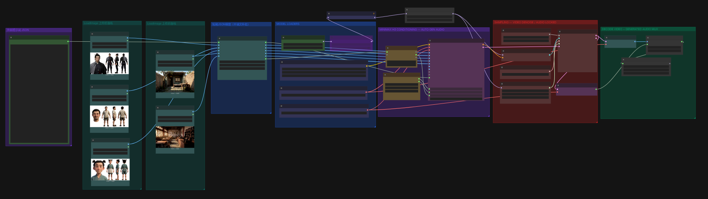
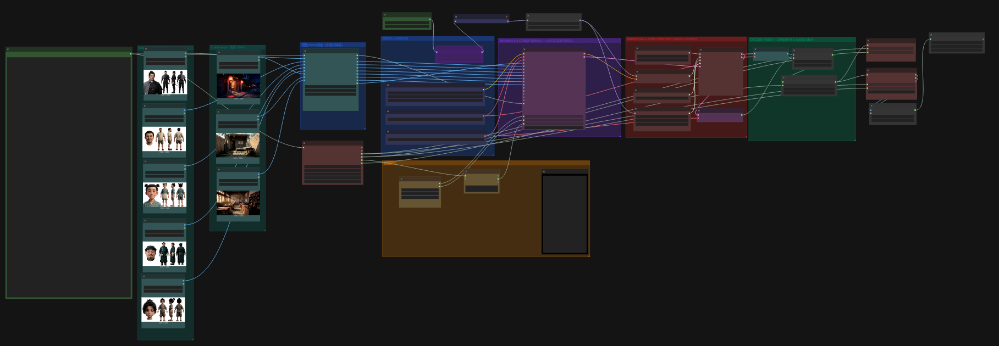

# ComfyUI-ShortDramaJSON

短剧 JSON → 角色/场景绑图 + 分镜循环 + 成片拼接。

## 说明

把工作流放到 `ComfyUI/custom_nodes/ComfyUI-ShortDramaJSON`，重启 ComfyUI。

1. 在「角色场景图绑定」粘贴短剧 JSON，按角色/场景名接参考图
2. 「分镜选择/循环」设开始/结束镜，输出当前镜提示词与时长
3. 单镜：只跑一镜即可；多镜：接「续跑下一镜」自动 Queue，最后用「本批全部分镜拼接」按序成片

示例工作流见 `example/`。

## 节点


| 节点       | 作用                                                    |
| -------- | ----------------------------------------------------- |
| 角色场景图绑定  | 按 JSON 建槽；第一行 `prompt_json` 直通，中间角色/场景左右对齐，末行 **总时长** |
| 分镜选择/循环  | 选当前镜，输出提示词/时长                                         |
| 续跑下一镜    | 自动 Queue 下一镜                                          |
| 本批全部分镜拼接 | 最后一镜跑完后按序拼全部                                          |


## JSON

```json
{
  "整体风格": "3D CG写实……气氛从白日密谋转入夜半……",
  "角色图片": {
    "杀手": "中年男子，黑发高束……",
    "地主": "中年男子，面容憨厚……",
    "店小二": "约十岁女孩，双丫髻……"
  },
  "场景图片": {
    "酒楼内部": "酒楼内堂……",
    "杀手住所": "僻静小院……"
  },
  "镜头规则": "各分镜均使用越肩镜头硬切……场景与人物引用统一写尖括号……",
  "分镜序列": {
    "分镜1": [
      {
        "编号": 1,
        "时长": "3s",
        "镜头": "越肩硬切，<地主>面部特写",
        "画面": "白天。<酒楼内部>角落方桌，……焦点在<地主>……",
        "对白": { "地主": "今夜把掌柜灌醉，亥时动手。" },
        "声音": "白日酒楼低语……口型同步"
      },
      {
        "编号": 2,
        "时长": "2s",
        "镜头": "越肩硬切，<店小二>面部特写",
        "画面": "仍是白天，仍在<酒楼内部>，切到<店小二>面部……",
        "对白": { "店小二": "好酒备足了，灌醉他就行。" },
        "声音": "接续白日酒楼环境音……口型同步"
      }
    ],
    "分镜2": [
      {
        "编号": 1,
        "时长": "3s",
        "镜头": "越肩硬切，<地主>面部特写",
        "画面": "白天。<杀手住所>檐下，……焦点在<地主>……",
        "对白": { "地主": "小二灌醉他。你侧门进，下手干净。" },
        "声音": "小院蝉鸣……口型同步"
      },
      {
        "编号": 2,
        "时长": "2s",
        "镜头": "越肩硬切，<杀手>面部特写",
        "画面": "仍是白天，仍在<杀手住所>，切到<杀手>面部……",
        "对白": { "杀手": "得令。亥时必到。" },
        "声音": "接续小院日间环境音……口型同步"
      }
    ]
  }
}
```

完整示例见 `file/短剧提示词_地主密谋乞丐救人.json`。

**顶层字段**


| 字段     | 说明                         |
| ------ | -------------------------- |
| `整体风格` | 全片画风、时段、气氛总述               |
| `角色图片` | 角色名 → 外观描述；键名即槽位名，有几个显示几个  |
| `场景图片` | 场景名 → 环境描述；同上              |
| `镜头规则` | 运镜/引用/一致性约束（会拼进当前镜上下文）     |
| `分镜序列` | `分镜1`、`分镜2`… → 镜头数组（可多镜切换） |


**分镜条目**


| 字段   | 说明                             |
| ---- | ------------------------------ |
| `编号` | 镜内序号                           |
| `时长` | 如 `"3s"`；节点按此求和                |
| `镜头` | 景别/切法，可用 `<角色名>`               |
| `画面` | 场景动作描述，引用 `<场景>` / `<角色>`      |
| `对白` | `{ "角色名": "台词" }`，键须在 `角色图片` 中 |
| `声音` | 环境音与口型要求                       |


**引用规则**

- 画面/镜头里用 `<名称>`，须与 `角色图片` / `场景图片` 的键一致
- 生成时展开为 `<名称>/<Picture N>`
- 同一分镜内时段、衣着、站位与场景保持不变
- 兼容旧键名 `角色档案` / `场景档案`

## 分镜

- **开始分镜 : 结束分镜**：从哪镜跑到哪镜（含）。开始不能大于结束。`2:2` 只跑第2镜，`1:5` 跑1到5
- 点「刷新分镜信息」会把结束镜同步成 JSON 总镜数

## 例图

**单个分镜生成**



**多场景循环生成**



**生成结果**

<video src="file/生成结果.mp4" controls width="100%"></video>

若预览无法播放，直接打开：[生成结果.mp4](file/生成结果.mp4)